# trans-home

通过网络访问本地网盘，类似访问云盘一样


## 使用技术

- spring boot2构建的前后端分离项目
- 使用Spring Security进行认证授权


## 实现功能


### 登录鉴权

- 记住我功能

- 登出

- 验证码

  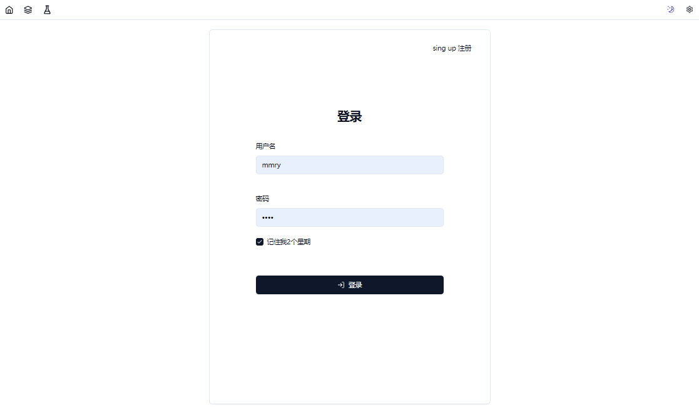

  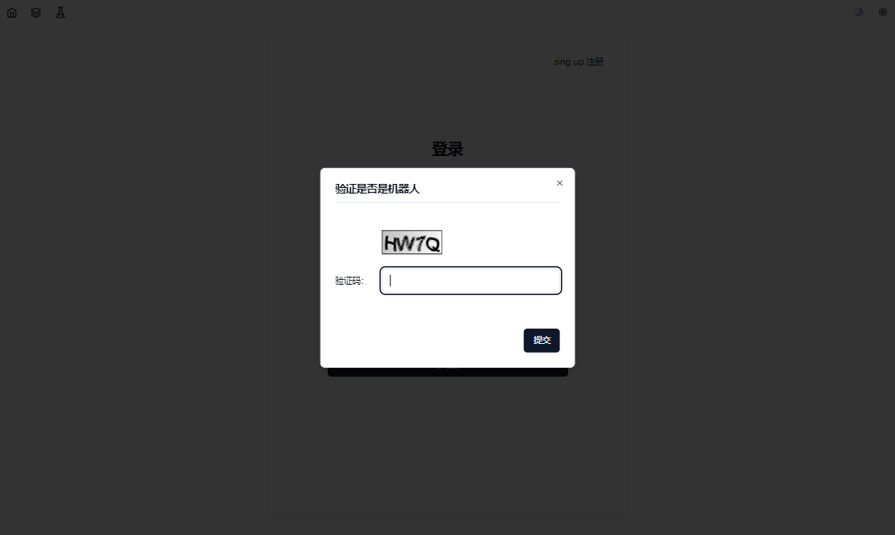 


### 浏览文件

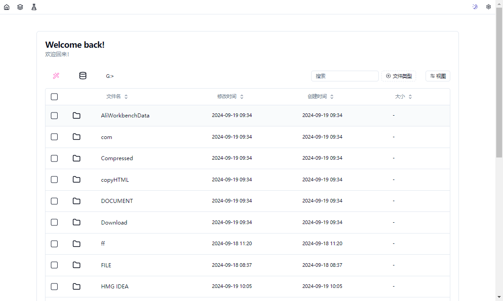 


- 可以按照大小 修改时间 创建时间 路径进行排序
  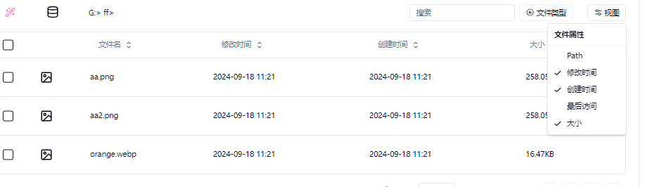 

- 可以按照文件的类型 文件夹 文件 音频 视频 图片进行筛选

  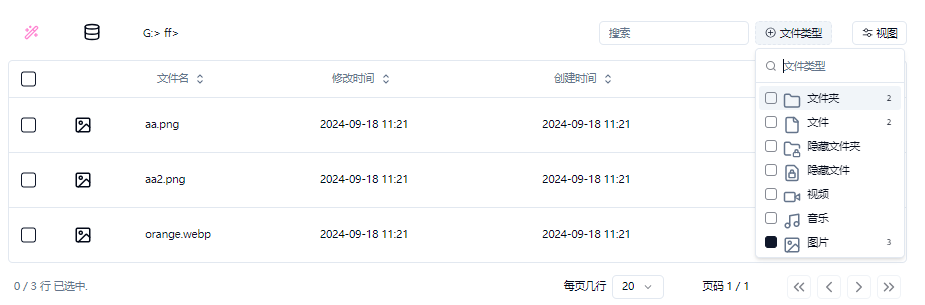 

- 可以按照文件名进行搜索来查找文件

  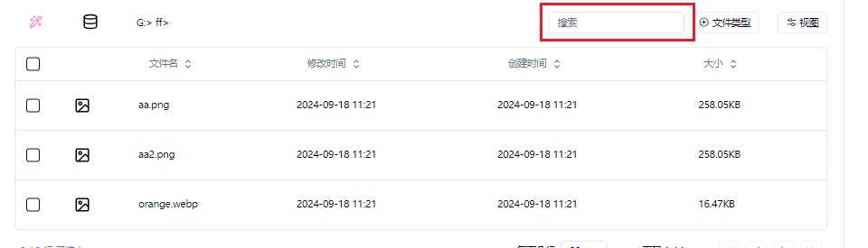 

- 可以选择盘符

  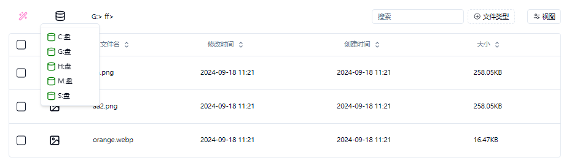 

- 进行文件操作

  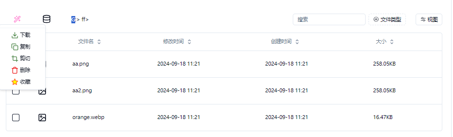


### 浏览图片


### 下载文件--支持批量打包下载

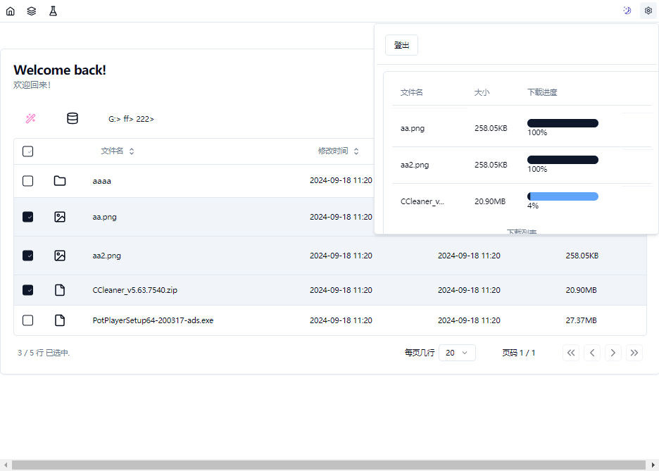 


### 文件下载有单独可视化窗口

 


### 剪切拷贝文件--支持批量

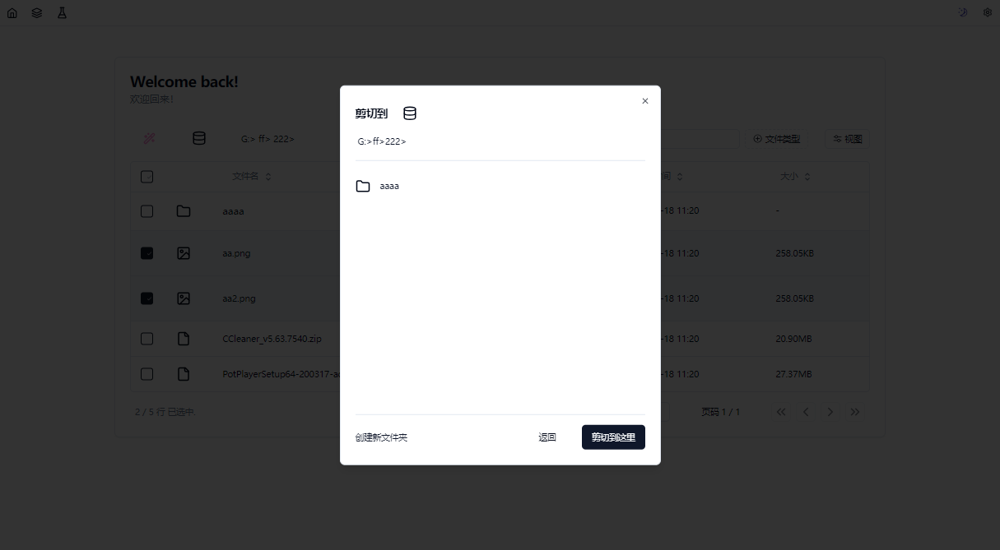


- 可以新建文件夹

  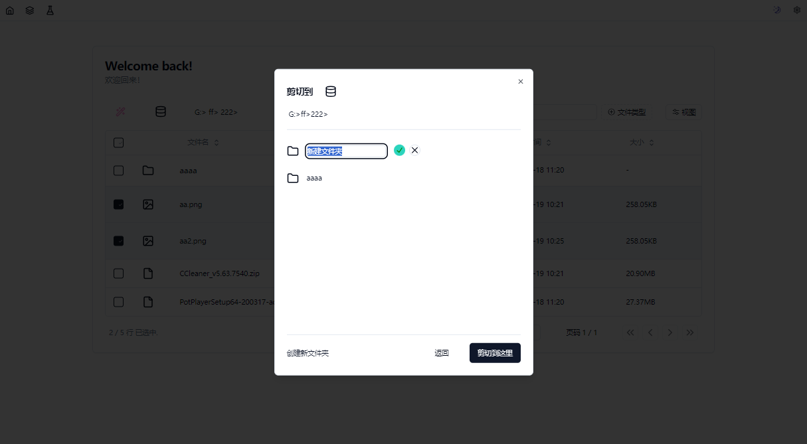

- 可以选择盘符

  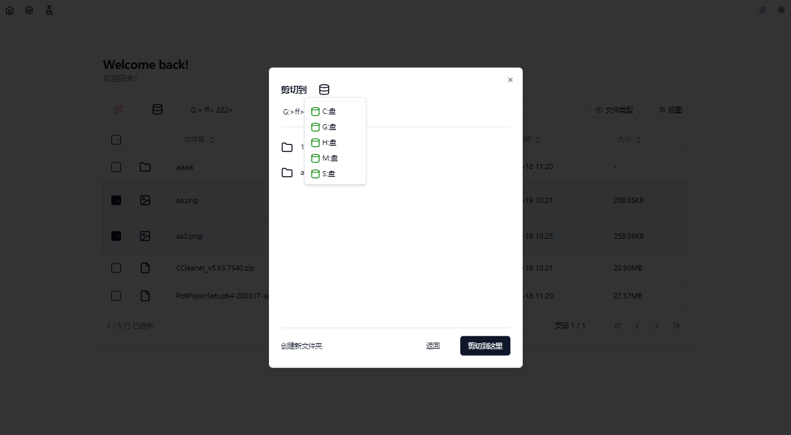 


## 相关配置


如果开发时出现跨域报错，修改跨域的允许的源	

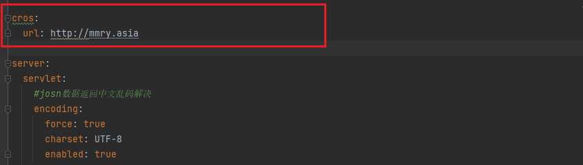  


数据库表结构和数据

```sql
/*
 Navicat Premium Data Transfer

 Source Server         : sql
 Source Server Type    : MySQL
 Source Server Version : 50719
 Source Host           : localhost:3306
 Source Schema         : db_home_transfer

 Target Server Type    : MySQL
 Target Server Version : 50719
 File Encoding         : 65001

 Date: 19/09/2024 09:14:35
*/

SET NAMES utf8mb4;
SET FOREIGN_KEY_CHECKS = 0;

-- ----------------------------
-- Table structure for kaptcha
-- ----------------------------
DROP TABLE IF EXISTS `kaptcha`;
CREATE TABLE `kaptcha`  (
  `uuid` varchar(64) CHARACTER SET utf8mb4 COLLATE utf8mb4_unicode_ci NOT NULL COMMENT '代替session用来标示用户的',
  `kaptcha` varchar(32) CHARACTER SET utf8mb4 COLLATE utf8mb4_unicode_ci NULL DEFAULT NULL COMMENT '验证码',
  PRIMARY KEY (`uuid`) USING BTREE
) ENGINE = InnoDB CHARACTER SET = utf8mb4 COLLATE = utf8mb4_unicode_ci ROW_FORMAT = Dynamic;

-- ----------------------------
-- Records of kaptcha
-- ----------------------------

-- ----------------------------
-- Table structure for persistent_logins
-- ----------------------------
DROP TABLE IF EXISTS `persistent_logins`;
CREATE TABLE `persistent_logins`  (
  `username` varchar(64) CHARACTER SET utf8mb4 COLLATE utf8mb4_unicode_ci NOT NULL,
  `series` varchar(64) CHARACTER SET utf8mb4 COLLATE utf8mb4_unicode_ci NOT NULL,
  `token` varchar(64) CHARACTER SET utf8mb4 COLLATE utf8mb4_unicode_ci NOT NULL,
  `last_used` timestamp(0) NOT NULL DEFAULT CURRENT_TIMESTAMP(0) ON UPDATE CURRENT_TIMESTAMP(0),
  PRIMARY KEY (`series`) USING BTREE
) ENGINE = InnoDB CHARACTER SET = utf8mb4 COLLATE = utf8mb4_unicode_ci ROW_FORMAT = Dynamic;

-- ----------------------------
-- Records of persistent_logins
-- ----------------------------

-- ----------------------------
-- Table structure for role
-- ----------------------------
DROP TABLE IF EXISTS `role`;
CREATE TABLE `role`  (
  `id` int(11) NOT NULL AUTO_INCREMENT,
  `name` varchar(32) CHARACTER SET utf8mb4 COLLATE utf8mb4_unicode_ci NOT NULL,
  `name_zh` varchar(32) CHARACTER SET utf8mb4 COLLATE utf8mb4_unicode_ci NOT NULL,
  PRIMARY KEY (`id`) USING BTREE
) ENGINE = InnoDB AUTO_INCREMENT = 4 CHARACTER SET = utf8mb4 COLLATE = utf8mb4_unicode_ci ROW_FORMAT = Dynamic;

-- ----------------------------
-- Records of role
-- ----------------------------
INSERT INTO `role` VALUES (1, 'ROLE_product', '商品管理员');
INSERT INTO `role` VALUES (2, 'ROLE_admin', '系统管理员');
INSERT INTO `role` VALUES (3, 'ROLE_user', '用户管理员');

-- ----------------------------
-- Table structure for user
-- ----------------------------
DROP TABLE IF EXISTS `user`;
CREATE TABLE `user`  (
  `id` int(11) NOT NULL AUTO_INCREMENT,
  `username` varchar(32) CHARACTER SET utf8mb4 COLLATE utf8mb4_unicode_ci NULL DEFAULT NULL,
  `password` varchar(255) CHARACTER SET utf8mb4 COLLATE utf8mb4_unicode_ci NULL DEFAULT NULL,
  `enabled` tinyint(1) NULL DEFAULT NULL,
  `accountNonExpired` tinyint(1) NULL DEFAULT NULL,
  `accountNonLocked` tinyint(1) NULL DEFAULT NULL,
  `credentialsNonExpired` tinyint(1) NULL DEFAULT NULL,
  PRIMARY KEY (`id`) USING BTREE
) ENGINE = InnoDB AUTO_INCREMENT = 4 CHARACTER SET = utf8mb4 COLLATE = utf8mb4_unicode_ci ROW_FORMAT = Dynamic;

-- ----------------------------
-- Records of user
-- ----------------------------
INSERT INTO `user` VALUES (1, 'root', '{bcrypt}$2a$10$1XVJ.3kVL7/dgarNYHDNg.RstblAycA79gcIbT1g8Lz.WYkaRM1Sm', 1, 1, 1, 1);
INSERT INTO `user` VALUES (2, 'admin', '{bcrypt}$2a$10$wnn4VFMjoawKdrPoe2do.e9ekW62a7Sof8l0N20BnsaiuqkIjEg5y', 1, 1, 1, 1);
INSERT INTO `user` VALUES (3, 'mmry', '{bcrypt}$2a$10$ip413ih4abcNs8Xf90tQnuRr3XiHxrcCT94GINqo5MAqknQrzhH2a', 1, 1, 1, 1);

-- ----------------------------
-- Table structure for user_role
-- ----------------------------
DROP TABLE IF EXISTS `user_role`;
CREATE TABLE `user_role`  (
  `id` int(11) NOT NULL AUTO_INCREMENT,
  `uid` int(11) NULL DEFAULT NULL,
  `rid` int(11) NULL DEFAULT NULL,
  PRIMARY KEY (`id`) USING BTREE,
  INDEX `uid`(`uid`) USING BTREE,
  INDEX `rid`(`rid`) USING BTREE
) ENGINE = InnoDB AUTO_INCREMENT = 5 CHARACTER SET = utf8mb4 COLLATE = utf8mb4_unicode_ci ROW_FORMAT = Dynamic;

-- ----------------------------
-- Records of user_role
-- ----------------------------
INSERT INTO `user_role` VALUES (1, 1, 1);
INSERT INTO `user_role` VALUES (2, 1, 2);
INSERT INTO `user_role` VALUES (3, 2, 2);
INSERT INTO `user_role` VALUES (4, 3, 3);

SET FOREIGN_KEY_CHECKS = 1;


```


## 后端


使用技术

Vue3 + pinia + shadcn + TanStack


后端git地址：

https://github.com/mmry0116/home_interface


